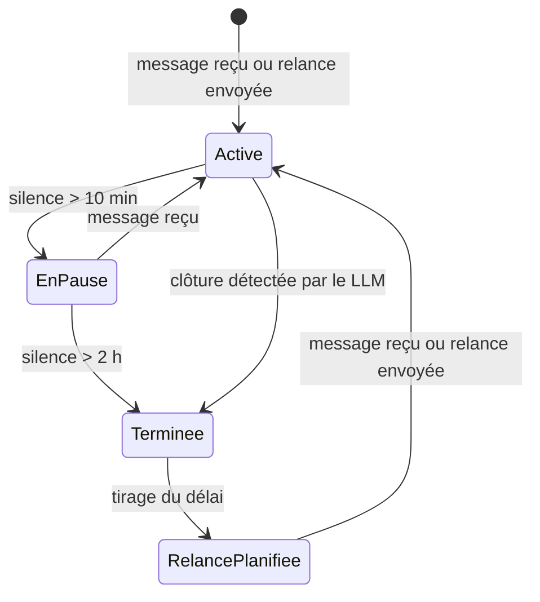
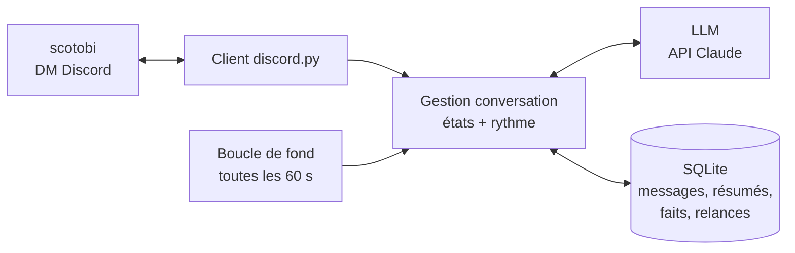

# Cahier des charges — Bot conversationnel Discord

24 septembre 2026 · William

## Contexte et objectif

L'objectif est un bot Discord qui discute en message privé avec le compte scotobi comme le ferait une personne : il répond, pose des questions, sent quand une conversation est finie et revient vers l'utilisateur de lui-même après un délai aléatoire.

Le bot tourne sur un compte bot Discord officiel. Le badge « APP » reste visible, mais l'effet « personne normale » vient du comportement : rythme de réponse, silences, relances, ton, mémoire.

## Périmètre

| Inclus | Exclu |
| --- | --- |
| Conversation en DM avec un seul utilisateur (scotobi) | Pilotage d'autres agents ou exécution d'actions |
| Détection de fin de conversation | Salons de serveur, groupes, plusieurs utilisateurs |
| Relances spontanées à délai aléatoire | Automatisation d'un compte utilisateur (self-bot) |
| Personnalité et style d'écriture configurables | Messages vocaux, images générées |
| Mémoire des conversations passées | Interface web |

## Cycle de vie d'une conversation

Chaque conversation passe par quatre états ; l'état courant et l'horodatage du dernier message sont stockés en base.

| ID | Exigence |
| --- | --- |
| C1 | Active : le bot répond à chaque message reçu |
| C2 | En pause : aucun message après 10 min de silence (seuil configurable) ; le bot ne relance pas dans ce laps |
| C3 | Terminée : après 2 h de silence (configurable), ou quand le LLM juge l'échange conclu (« bonne nuit », « à plus », sujet épuisé) |
| C4 | La détection de clôture est une sortie JSON du LLM à chaque réponse : `{"reponse": [...], "conversation_finie": bool}` |
| C5 | À la fin d'une conversation, un résumé est généré et stocké (voir Mémoire), puis une relance est planifiée |
| C6 | Si l'utilisateur écrit pendant qu'une relance est planifiée, elle est annulée |

## Relances aléatoires

Après chaque conversation terminée, le bot tire un délai aléatoire, puis revient vers l'utilisateur avec un sujet choisi à partir de la mémoire.

| ID | Exigence | Valeur par défaut |
| --- | --- | --- |
| R1 | Délai tiré selon une loi triangulaire (min, mode, max) | 3 h · 10 h · 30 h |
| R2 | Aucune relance pendant les heures calmes ; une cible qui y tombe est reportée à un horaire aléatoire du matin | 23 h – 9 h, report entre 9 h et 12 h |
| R3 | Si une relance reste sans réponse, la suivante utilise un délai multiplié | ×3 |
| R4 | Après N relances consécutives sans réponse, le bot arrête de relancer jusqu'au prochain message de l'utilisateur | N = 2 |
| R5 | Plafond de relances spontanées par jour | 2 |
| R6 | Au déclenchement, le LLM reçoit les derniers résumés et choisit un angle : suite d'un sujet évoqué, prise de nouvelles, question ouverte | — |
| R7 | Une relance ne répète pas le sujet des 3 relances précédentes | — |
| R8 | Tous les paramètres sont dans un fichier de config modifiable sans toucher au code | — |

## Style et rythme d'écriture

| ID | Exigence |
| --- | --- |
| S1 | Délai avant réponse variable : 3 à 60 s, proportionnel à la longueur du message reçu et de la réponse, avec une part aléatoire |
| S2 | Indicateur « en train d'écrire » affiché pendant ce délai |
| S3 | Réponse découpée en 1 à 3 messages courts, envoyés avec un petit intervalle entre eux |
| S4 | Personnalité définie dans un fichier prompt : prénom, caractère, centres d'intérêt, façon de parler |
| S5 | Ton oral en français : phrases courtes, pas de listes, pas de mise en forme, pas de formules d'assistant (« Bien sûr ! », « N'hésite pas… ») |
| S6 | Au plus une question par message ; le bot ne pose pas une question à chaque réponse |
| S7 | Le bot peut répondre brièvement (« ah ouais ? », « mdr ») quand le message ne demande pas plus |
| S8 | Messages consécutifs de l'utilisateur regroupés : le bot attend quelques secondes après le dernier avant de répondre à l'ensemble |

## Mémoire

Le bot garde deux niveaux de mémoire, réinjectés dans le contexte à chaque réponse et à chaque relance.

| ID | Exigence |
| --- | --- |
| M1 | Court terme : les 30 derniers messages de la conversation en cours |
| M2 | Long terme : un résumé de 3 à 5 lignes par conversation terminée, avec date et sujets |
| M3 | Faits durables extraits des conversations (projets, goûts, événements à venir), stockés à part et mis à jour |
| M4 | Contexte envoyé au LLM = prompt de personnalité + faits durables + 5 derniers résumés + messages récents + date et heure actuelles |
| M5 | Commande DM `!oublie` pour effacer toute la mémoire |

## Architecture, stack et sécurité

Un seul processus Python contient le client Discord, une boucle de fond qui gère les états et les relances, et une base SQLite.

La boucle de fond vérifie chaque minute les transitions (pause, fin) et les relances arrivées à échéance.

| Brique | Choix |
| --- | --- |
| Langage | Python 3.12 |
| Discord | discord.py 2.x, intents DM + `message_content` |
| LLM | API Groq (compatible OpenAI) — décision utilisateur : pas de clé Anthropic ; modèle rapide pour les réponses, même modèle pour résumés et détection de fin |
| Planification | `discord.ext.tasks` (boucle 60 s) |
| Stockage | SQLite : tables `messages`, `conversations`, `resumes`, `faits`, `relances` |
| Config | `.env` (secrets) + `config.yaml` (seuils, délais) + `persona.md` (personnalité) |
| Hébergement | PC perso ou petit VPS, redémarrage auto via systemd ou Docker |

Sécurité : le bot ignore tout message dont l'auteur n'est pas l'ID numérique de scotobi (stocké dans `.env`). Le token et la clé API restent hors dépôt Git et hors logs. Les relances en attente sont stockées en base, pour survivre à un redémarrage.

## Planning, critères d'acceptation et questions ouvertes

Chaque lot donne un bot utilisable ; on peut s'arrêter après n'importe lequel.

| Lot | Contenu | Exigences |
| --- | --- | --- |
| 1 — Il répond | Bot en DM, filtre sur l'ID, LLM + personnalité, mémoire court terme | S4, S5, M1 |
| 2 — Il parle comme quelqu'un | Délais variables, « en train d'écrire », messages découpés, regroupement | S1–S3, S6–S8 |
| 3 — Il sent la fin | États, détection de clôture, résumés de fin | C1–C6, M2 |
| 4 — Il revient | Relances aléatoires avec garde-fous, choix du sujet | R1–R8 |
| 5 — Il se souvient | Faits durables, `!oublie` | M3–M5 |

Critères d'acceptation :

- [ ] Un message d'un autre compte ne reçoit aucune réponse
- [ ] Aucune réponse ne contient de liste, de titre ou de formule d'assistant
- [ ] Sur 10 relances, les délais sont tous différents et aucune ne tombe entre 23 h et 9 h
- [ ] Après 2 relances ignorées, le bot se tait jusqu'au message suivant
- [ ] Une relance fait référence à un sujet réellement abordé avant
- [ ] Après un redémarrage, les relances planifiées et la mémoire sont conservées

Questions ouvertes :

- [ ] Quelle personnalité : prénom, âge apparent, caractère, sujets favoris ?
- [ ] Le bot doit-il dire qu'il est une IA si on le lui demande ?
- [ ] Fourchettes de délais de relance qui te conviennent ?
- [ ] Où tourne le bot : PC allumé en permanence ou VPS ?
